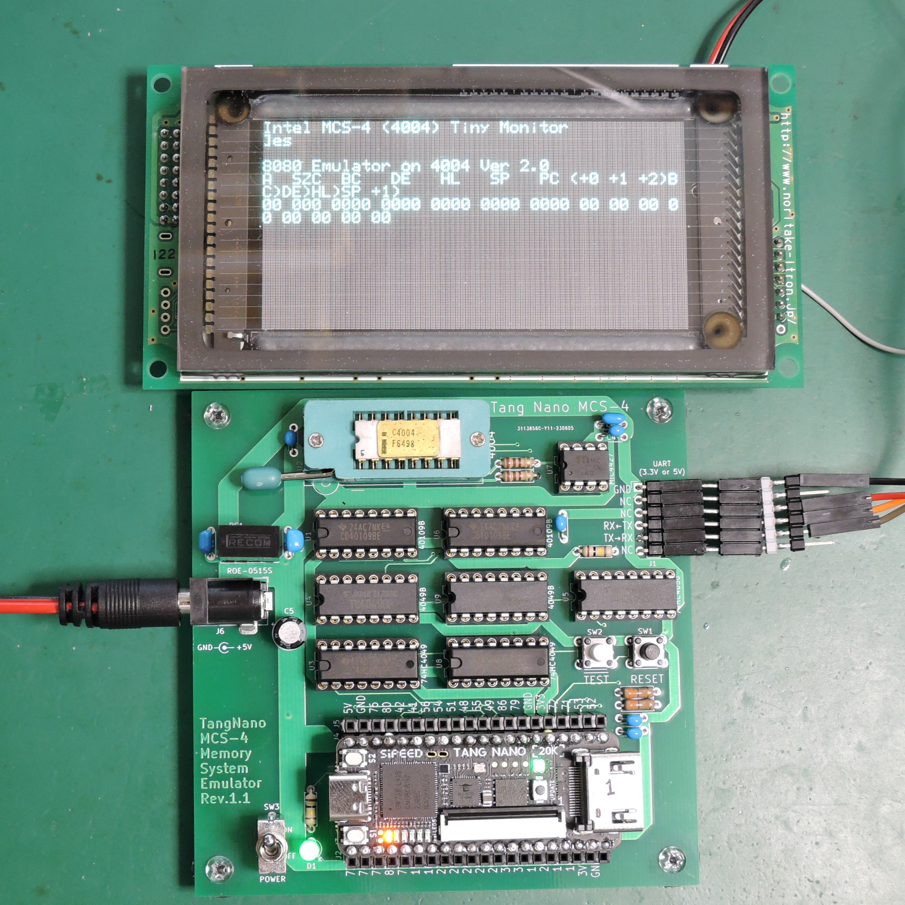
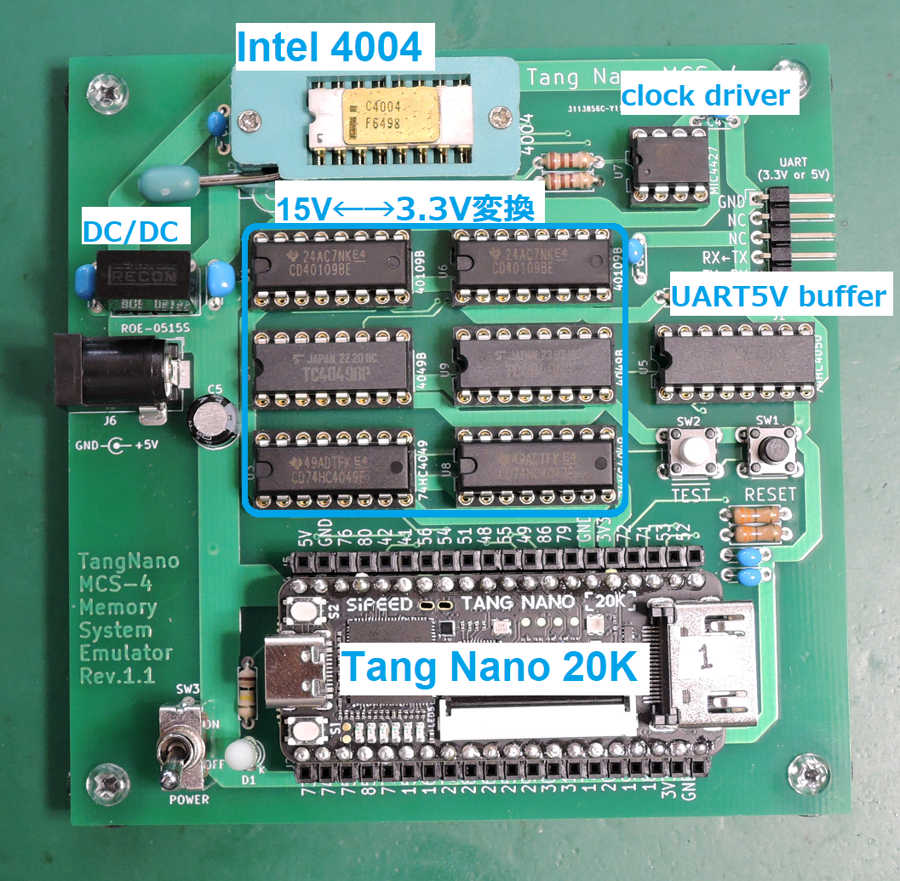

# tangnano-MCS4memory
Memory system for Intel 4004 using Tang Nano 20K

This document is written mostly in Japanese.
If necessary, please use a translation service such as DeepL (I recommend this) or Google.

## 概要
[emu8080on4004](https://github.com/ryomuk/emu8080on4004)を動作させるための4004実験ボード(Rev.2.1)の「4004以外の部分」(主にメモリシステム)をTang Nano 20K に実装しました．
これにより，DigikeyやMouserで入手可能な部品とTangNano20KだけでIntel4004を動作させることができます．

## ボードの構成

部品のほとんどはレベル変換用IC(15V←→3.3V, 15Vクロックドライバ, UART用5V耐圧バッファ)です．

## Tang Nano 20Kに実装したもの
- 4002 x 4個 (data ram, 出力ポート)．出力ポートのLEDはRAM0の4個のみ．
- 4289 のプログラムメモリへのアクセス機能(ポート機能は未実装)
- プログラム領域のROM (4KB)
- プログラム領域のRAM (256byte x 256バンク = 64KB)
- 2相クロックジェネレータ

Rev.2.1ボードにおける下記の赤枠の部分がTangNano20Kに実装されています．

## 電源について
一般に，4004の回路は「VSS=-15V, VDD=0V(GND)」もしくは，「VSS=-10V, VDD=+5V, GND=0V」で設計されることが多いですが，3.3VCMOSへのレベル変換を考えた場合，
「VSS=+15V, VDD=0V(GND)」とした方が扱いやすそうだったのでそのようにしています．
(ちなみに，15V系CMOSはVSSとVDDは4004と逆で「VSS=0V(GND)，VDD=+15V」です．)
- +15Vが必要なのは4004とクロック用バッファだけで，消費電流は40mA(電力0.6W)程度なので，5V→15V,1WのDC/DCコンバータの(RECOM, ROE0515S)で生成しています．
- 外部から供給する電源は5Vのみで，消費電流はTangNano(100mA程度)とあわせて250mA程度です．いわゆる普通の5V USB電源でも動作します．

## 4004実験ボード(Rev.2.1)との互換性について
- ソフトウェアはバイナリレベルで互換性があるはずです．
- 4002の出力ポートのLED(計16個)は，RAM0の4個だけTangNanoのオンボードLEDとして実装されています．
- UARTは74HC4050経由にしたので，3.3V, 5Vの両方に対応しているはずです．(動作確認済なのは5Vのみ)

## ブログ
関連する情報が書いてあるかも．
- [Intel 4004 関連記事の目次@ブログの練習](https://blog.goo.ne.jp/tk-80/e/3fa1e2972737c7b7d1b83f4e7bd648a2)

## 更新履歴
- 2023/6/14: 初版公開

